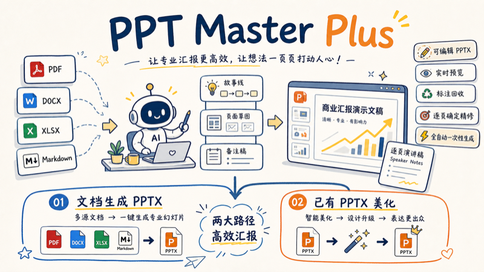

# PPT Master Plus



`ppt-master-plus` 是一个面向高质量、可编辑 PPTX 生产的通用 AI agent skill。它以 [`ppt-master`](https://github.com/hugohe3/ppt-master) 的 SVG→PPTX 方法论和制作链路为底座，融合上游 [`hugohe3/ppt-master`](https://github.com/hugohe3/ppt-master) 的 PPTX intake、美化、原生增强与 Confirm UI 能力，并新增传统行业模板、分阶段审核和软依赖绘图路由。

它的目标不是“快速吐几页幻灯片”，而是把资料理解、叙事组织、视觉规范、逐页制作、讲稿质检和最终导出串成一条可控的生产线。

## 推荐 AI Agent 与模型

这个 skill 适合在支持本地文件、脚本执行和长上下文工作的 AI agent 环境中使用。推荐入口：

| AI Agent | 推荐模型 / 档位 | 适用场景 |
|---|---|---|
| Antigravity CLI | `gemini-flash 3.5` / `high` | 长资料 intake、连续制稿、需要较强吞吐和上下文保持的 PPTX 生产 |
| Codex | `gpt5.5` / `medium` | 叙事重构、设计确认、逐页 SVG 制作和质量检查的均衡配置 |

如果环境允许，也可以按任务阶段切换：Antigravity CLI 处理资料量大、连续生产压力高的项目；Codex 处理需要精修判断、文件修订和质量检查的项目。

## 主要功能

- 从 PDF、DOCX、XLSX、PPTX、URL、Markdown 或粘贴文本创建新的 PPTX。
- 支持两种生产模式：
  - 逐页确定精修：Intake、叙事、提纲、生产路线、逐页预览和最终验收都停下来确认。
  - 全自动一次性生成：完成必要设计确认后自动进入制作，不逐页等待。
- 支持已有 PPTX 的多种路线：
  - 保留页序和文字的美化。
  - 将 PPTX 当作资料重新组织成新故事。
  - 对成品 PPTX 追加讲稿、音频、自动播放和转场等原生增强。
- 支持浏览器实时预览、页面注解回收、SVG 质量检查、讲稿质量检查和 PPTX 导出验证。
- 支持可选绘图路由：
  - 普通展示图、图表、信息图默认走内置 SVG，保证和 PPTX 导出链路最稳。
  - [`fireworks-tech-graph`](https://github.com/yizhiyanhua-ai/fireworks-tech-graph)：正式、规整的架构图和技术流程图。
  - [`excalidraw`](https://github.com/Agents365-ai/excalidraw-skill)：手绘、白板、头脑风暴风格，并保留可编辑源文件。
  - [`Mermaid`](https://github.com/Agents365-ai/creating-mermaid-diagrams) / [`PlantUML`](https://github.com/Agents365-ai/plantuml-skill) / [`draw.io`](https://github.com/Agents365-ai/drawio-skill) / [`tldraw`](https://github.com/Agents365-ai/tldraw-skill) 作为更专门的外部图资产路线，仅在用户明确需要或内容非常匹配时使用。
  - 缺失依赖时回退到内置 SVG，不安装、不阻塞。

## 常见使用方式

### 1. 从文档创建新的 PPTX

适合把 PDF、DOCX、XLSX、PPTX、网页、Markdown 或一段文字重新组织成一份新的演示文稿。这个路线会把资料当作内容来源，由 Strategist 重新梳理叙事、页数、结构和视觉风格；原始文档的页序不需要保留，必要时可以合并、拆分、删减或重排内容。

典型输入：

```text
使用 ppt-master-plus，把 /path/to/report.pdf 做成一份 12 页左右的路演 PPT，面向投资人，风格专业克制，走逐页确定精修。
```

执行方法：

1. 明确生产模式：`逐页确定精修` 或 `全自动一次性生成`。
2. 导入资料并转成 Markdown；如果源文件是 PPTX，也会先作为资料提取内容和结构事实。
3. 完成八项设计确认：画布、页数、受众、风格、配色、图标、字体、图片策略。
4. 生成 `design_spec.md` 和 `spec_lock.md`，然后按页生成 SVG、讲稿和预览；在 `逐页确定精修` 模式下，每页确认后再继续下一页。
5. 通过 SVG 质量检查和讲稿检查后，导出可编辑 PPTX。

产出承诺：内容可以被重新组织，最终交付是一份新的原生可编辑 PPTX，而不是对源文件逐页贴图。

### 2. 美化已有 PPTX

适合已经有一份 PPTX，希望保留原页数、原页序和每页文字，只优化版式、层级、留白、对齐、图表呈现和整体专业度。这个路线走 `beautify`，会继承源 PPTX 的画布、配色和字体倾向，但不会把它当作“模板”去填充另一批新内容。

典型输入：

```text
使用 ppt-master-plus，美化 /path/to/deck.pptx，保留每页文字和页序不变，只重新排版，让它更专业。
```

执行方法：

1. 确认这是 `beautify` 路线：页数、页序、每页文字和数据值都保持 1:1。
2. 读取源 PPTX 的画布比例、主题色、实际用色、字体、图片、表格和图表数据。
3. 让用户确认继承哪套视觉身份，以及哪些复杂图表、拥挤页面或可忽略元素需要特别处理。
4. 逐页按原内容重做 SVG 布局，图表和表格按原数据重新绘制，图片重新布局。
5. 检查每页内容覆盖、SVG 质量和讲稿后，导出新的可编辑 PPTX。

产出承诺：内容不改写、不增删、不换页序；改的是视觉组织和表达质量。若用户希望拆页、合页、重写故事线或调整页数，应改走“从文档创建新的 PPTX”路线。

## 浏览器确认、预览与反馈

`ppt-master-plus` 生产过程中会自动打开本地浏览器页面，通常是 `http://localhost:5050`；如果端口被占用，会自动换到下一个可用端口，AI Agent 会把实际 URL 告诉用户。浏览器页面只是确认、预览和反馈界面，真正的文件修改和导出仍由 AI Agent 执行。

### 设计确认页面

在 Strategist 阶段会打开一个设计确认页面，用来确认画布、受众、页数、视觉风格、配色、字体、图标、图片策略等关键参数。

使用方法：

1. 第一屏先确认方向性选择，例如画布、受众、交付目的、叙事模式和视觉风格。
2. 点击页面上的 **Next / 下一步** 后，AI Agent 会根据你的选择重新推导配色、字体、图片策略等细节。
3. 第二屏检查推荐方案，可以直接选择候选卡片，也可以在 Custom 输入框里写自己的要求。
4. 点击 **Confirm / 确认** 后，页面会保存选择并关闭；AI Agent 会读取确认结果，继续生成 `design_spec.md` 和 `spec_lock.md`。

如果浏览器页面打不开，AI Agent 会在聊天里给出同样的确认项，用户直接在聊天中回复即可。

### 逐页预览页面

进入 SVG 制作阶段后，会打开逐页预览页面。它显示当前生成的幻灯片 SVG，支持翻页、选择元素、直接微调和写批注。

常用操作：

1. 用顶部的上一页 / 下一页按钮，或键盘方向键浏览页面。
2. 点击页面元素可以选中它；右侧面板会显示可编辑属性。
3. 对于确定性的微调，例如改文字、颜色、位置、大小，可以在右侧面板直接修改。预览会立刻变化，但要点击 **Apply changes / 应用修改** 才会写入 `svg_output/`。
4. 对于需要 AI 判断的修改，例如“这一页层级太乱，重新排一下”“把这个图改得更像技术架构图”，在右侧批注框写说明，点击 **Add annotation / 添加批注**，再点击 **Apply changes / 应用修改**。
5. 保存批注后，页面会弹出一段可复制的提示词。把这段提示词粘贴回 AI Agent 聊天，或直接说“应用刚才的批注”，AI Agent 会读取批注、修改对应 SVG，并重新导出 PPTX。

注意：浏览器里的 **Apply changes / 应用修改** 只把编辑或批注写回项目文件，不会自动重新生成 PPTX。需要刷新最终文件时，回到 AI Agent 里说“重新导出”或“应用批注并重新导出”。

### 回到 AI Agent 修改

用户可以随时跳过浏览器，在聊天里直接描述修改，例如：

```text
第 3 页标题改成“增长飞轮”，右侧流程图再简化一点，然后重新导出。
```

AI Agent 会根据聊天指令或浏览器批注修改 `svg_output/`，运行 SVG 后处理和 PPTX 导出。修改完成后，如果预览页面还开着，刷新浏览器或重新选择页面即可看到新的 SVG；如果需要新的 PPTX 文件，使用最新导出的 `exports/*.pptx`。

## 已有 PPTX 的处理边界

给定一个 `.pptx`，`ppt-master-plus` 可以美化，但不会把它当作“用户提供模板”来填充新内容。

| 用户意图 | 支持情况 | 路线 |
|---|---|---|
| 保留原页数、页序、每页文字和数据，只优化版式、层级、留白和视觉一致性 | 支持 | `beautify` |
| 把 PPTX 当作资料来源，重新组织故事、拆分/合并页面、调整页数或重排结构 | 支持 | 主生产流程 |
| 对成品 PPTX 追加讲稿、音频、自动播放、转场等，不改变可见内容和布局 | 支持 | `native-enhance-pptx` |
| 上传或指定一个 PPTX 作为模板，再填入另一批新内容 | 当前不支持 | 如需基于该 PPTX 产出新 deck，请改走主生产流程；内部模板化能力作为未来扩展，不作为当前替代路径承诺 |

这个边界是故意的：美化关注“把现有 deck 做得更好”，主流程关注“从资料生成新的 deck”，而用户提供模板填充容易把外部 deck 当作不稳定的占位符系统处理，已经从公开能力中移除。

## 模板与图例丰富度

当前模板资产覆盖“整套风格模板、页面结构、图表图例、图标库”四层：

| 资产类型 | 数量 / 规模 | 用途 |
|---|---:|---|
| Deck 模板目录 | 29 套 | 覆盖企业、行业、教育、党建、咨询、学术、数据看板等完整视觉风格 |
| 传统行业模板 | 21 套 | `ppt-master-plus` 新增资产，适合中文商业汇报、教学课件、竞聘述职、开题答辩、项目架构等场景 |
| 可视化 / 图表 SVG 模板 | 71 个 | 覆盖图表、流程、框架、信息图、结构图等常见表达 |
| Layout 模板包 | 7 组 | 提供页面结构骨架，辅助稳定排版节奏 |
| Brand preset | 2 组 | 提供品牌色、字体、语气等身份约束 |
| 图标 SVG | 11,000+ 个 | 多套图标库，可按风格统一检索和复制到项目 |

这些模板不是单纯的静态素材库。内置模板只在用户明确选择内部模板路径，或工作流需要调用图表、图标等基础表达组件时参与；默认不会把用户上传的 PPTX 当模板使用。Strategist 根据资料类型、受众、交付目的、内容密度和视觉风格规划表达方式；Executor 再逐页读取 `spec_lock.md`，把模板、图表、图标和内容约束落实到可导出的 SVG / PPTX。

## 基本架构

```text
Source Materials
  ↓
Intake
  - PDF / DOCX / XLSX / PPTX / Web / Markdown 转 Markdown
  - PPTX intake 抽取画布、页结构、表格、图表和版式事实
  ↓
Production Mode Gate
  - 逐页确定精修：逐页确认后继续
  - 全自动一次性生成：确认设计后连续生产
  ↓
Strategist
  - 资料理解
  - 叙事重构
  - 八项设计确认
  - design_spec.md + spec_lock.md
  ↓
Optional Assets
  - AI / Web / User / Formula 图片资源
  - Fireworks / Excalidraw / 内置 SVG 图示路由
  ↓
Executor
  - 顺序逐页手写 SVG
  - 实时预览
  - 质量检查
  ↓
Post-processing
  - SVG 修整
  - 讲稿检查
  - PPTX 导出
  - 可选原生增强
```

核心入口是 [`SKILL.md`](SKILL.md)。分阶段生产流程在 [`workflows/gated-production.md`](workflows/gated-production.md)，上游与本地合并记录在 [`references/upstream.md`](references/upstream.md)。

## 致敬 ppt-master

`ppt-master-plus` 继承并致敬 [`ppt-master`](https://github.com/hugohe3/ppt-master)：它保留了原有 skill 对“原生可编辑 PPTX”“高质量 SVG 页面”“模板驱动制作”和“中文汇报场景”的执着，同时在此基础上新增了 21 套传统行业模板、讲稿质检能力和更严格的生产流程。

这个 `plus` 不是推翻，而是延展：在 [`ppt-master`](https://github.com/hugohe3/ppt-master) 的地基上，把上游的新工具链、分阶段审核、PPTX 原生增强、软依赖绘图路由和更严格的生产纪律合并到一条更完整的工作流里。

感谢 [`ppt-master`](https://github.com/hugohe3/ppt-master) 打下的底层方法论：先理解内容，再设计叙事；先锁定规范，再逐页制作；最终交付的不是图片截图，而是可编辑、可演示、可继续加工的 PowerPoint。
