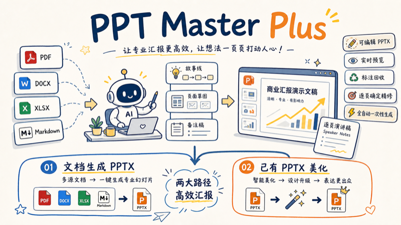

# PPT Master Plus



`ppt-master-plus` 是一个面向高质量、可编辑 PPTX 生产的通用 AI agent skill。它以 [`ppt-master`](https://github.com/hugohe3/ppt-master) 的 SVG→PPTX 方法论和制作链路为底座，在本仓库中补强 PPTX intake、保真美化、原生增强与 Confirm UI 能力，并新增传统行业模板、分阶段审核和软依赖绘图路由。

它的目标不是”快速吐几页幻灯片”，而是把资料理解、叙事组织、视觉规范、逐页制作、讲稿质检和最终导出串成一条可控的生产线。

用户只需选择三类目标：重新生成/设计页面走 **Generate PPTX**；保留现有
演示文稿并局部修改走 **Edit Native PPTX**；显式导入用户给定的 `.pptx`
文件作为品牌参考、再用另一组内容生成新文件走 **Create PPTX from Template**。详细判定见
[`workflows/routing.md`](workflows/routing.md)。

## 安装

复制以下 prompt，发给你的 AI Agent 即可完成安装：

```
请安装并使用 ppt-master-plus skill：https://github.com/gnuhpc/ppt-master-plus

可选伴侣 skill（按需安装，缺失时自动降级回内置 SVG）：
- fireworks-tech-graph（正式技术架构图）：https://github.com/yizhiyanhua-ai/fireworks-tech-graph
- excalidraw（手绘/白板风格）：https://github.com/Agents365-ai/excalidraw-skill
- Mermaid（流程图/时序图/ER 图）：https://github.com/Agents365-ai/creating-mermaid-diagrams
- PlantUML（UML/组件图）：https://github.com/Agents365-ai/plantuml-skill
- draw.io（拓扑/云厂商图标）：https://github.com/Agents365-ai/drawio-skill
- tldraw（tldraw 白板）：https://github.com/Agents365-ai/tldraw-skill
```

## 与 ppt-master 的功能对比

`ppt-master-plus` 是在 `ppt-master` 的基础上进行了全方位能力扩充的进阶版本。以下是核心功能的对比：

| 功能维度 | `ppt-master` (标准版) | `ppt-master-plus` (进阶版) |
| :--- | :--- | :--- |
| **定位与重点** | 严格串行的多源资料→SVG→PPTX 生产链，强调内容理解、模板/规范锁定、逐页手写 SVG、质量检查和原生可编辑 PPTX 导出。 | 在同一方法论上扩展为更完整的 PPTX 生产系统，重点补强已有 PPTX 处理、逐页确认、批注回修、讲稿门禁、原生增强和多源技术图路由。 |
| **生成模式控制** | 默认在八项设计确认后连续生成整份 PPT；长文档可在 Step 5 后用 `resume-execute` 跨对话进入 Phase B。 | 把 `continuous` / `gated` / `split` 明确纳入 Confirm UI 与 `spec_lock.md`：可全自动一次性生成，也可逐页确定精修，长文档仍可跨对话生产。 |
| **网页配置端与批注机制** | 有 Confirm UI 作为八项设计确认界面，也有 Live Preview；生成期继续按串行流程推进，注解主要在导出后按 `live-preview` 工作流统一处理。 | Confirm UI 升级为两阶段确认，覆盖 `content_divergence`、`generation_mode`、`transition_effect`、`refine_spec` 等字段；生成期通过 `--wait-annotation` 监听 **Apply changes**，可在安全检查点自动读取批注并回修。 |
| **Live Preview 页内直接编辑** | 支持浏览器实时预览、staged direct edits（文本与 SVG 属性暂存后应用）和批注回收；导出后可按工作流处理注解并重新导出。 | 保留这些能力，并把它们接入 Gated/Continuous 生产闭环：逐页门禁下每页可确认、批注、修复、再确认；Continuous 下也能在生成安全点捕获批注并自动重挂监听。新增快速标注浮窗（预设问题标签 + 自由文本）、整页标注、Shift+单击多选、右键重叠元素选择器、键盘导航和快捷键提示栏。 |
| **演讲稿在线编辑** | 生成 speaker notes，并通过 `total_md_split.py` 拆分进 PPTX；主要由 Agent/文件流程维护讲稿。 | Live Preview 左侧面板内置 **目录 / 演讲稿** 切换标签：可直接编辑当前页讲稿，点击 **保存** 后写入 `notes/<slide>.md`，无需 Apply changes。 |
| **PPTX intake / source profile** | PPTX 可经 `ppt_to_md.py` 提取为 Markdown 后作为普通资料进入主流程。 | `import-sources` 会额外运行 `pptx_intake.py`，生成 `analysis/source_profile.json`、`<stem>.identity.json`、`<stem>.slide_library.json`，把画布、主题、几何、表格和图表事实提供给 Strategist 作上下文。 |
| **美化入口路由** | 既有 PPTX 作为资料输入主生产流程，Strategist 可自由重构叙事、页数、页序和视觉系统；不单独区分“保留原稿”的美化契约。 | 路由边界更清晰：重新设计 → Generate PPTX；保留原生设计并局部修改 → [`Edit Native PPTX`](workflows/edit-native-pptx.md)；显式 1:1 重排 → [`faithful-beautify`](workflows/profiles/faithful-beautify.md)。 |
| **保真美化（Faithful Beautify）** | 不提供独立 1:1 保真美化路线；若输入 PPTX，仍按资料重建，不把原页数、页序、逐页文字或母版当作锁定契约。 | 专属工作流 [`beautify-pptx.md`](workflows/profiles/faithful-beautify.md)：<br>• **画布原尺寸**：`beautify_identity.py` 从 PPTX `p:sldSz` 读取精确像素尺寸，不强制归一化到 1280×720<br>• **内容冻结契约**：`pptx_intake.py` + `beautify_inventory.py` 生成逐页台账（文字/图表数据/表格/图片），文字逐字冻结，数据值锁定，严格 1:1 页数映射<br>• **源身份提取**：`analysis/<stem>.identity.json` 含主题调色板、实际观察字体/字号；Confirm UI 以源 PPT 风格预填，用户可确认或覆盖<br>• **`preserve_master`**：OOXML 级逐页保留，源第 N 页的 slideLayout/master 映射到输出第 N 页，主版式背景/Logo/页脚等 PPT 原生元素由母版承载<br>• **输出验证**：对导出 PPTX 重跑 `ppt_to_md.py`，逐页核对文字保真度和页数 |
| **Deck 模板** | 当前索引 2 套。 | **30 套**：保留 Plus 原有中文行业模板，并并入 Master 缺失项；配 3 套专属版式规范指导文件（[`executor-general.md`](references/executor-general.md)、[`executor-consultant.md`](references/executor-consultant.md)、[`executor-consultant-top.md`](references/executor-consultant-top.md)）。用户导入的 PPTX 一律不注册为 Deck。 |
| **图表 / 信息图 SVG** | 当前索引 33 个。 | **139 个**，冲突项以 Plus 资产为准。 |
| **Layout 骨架** | 当前索引 7 组。 | **37 组**，同时保留 legacy flat 与新增 structured workspace。 |
| **Brand / Style preset** | 20 套 Brand、12 套 Style。 | **30 套 Brand、12 套 Style**；包括 `apsara_yunqi_26_light`、`ffa_shenzhen` 与 `flink_ai_style`。 |
| **Table / Sound** | 6 个 Table、186 个 Sound。 | 同步并入 **6 个 Table、186 个 Sound**，仅在显式原生对象或音视频工作流中启用。 |
| **图标库** | 12,027 个 SVG，含 chunk-filled / phosphor-duotone / simple-icons / tabler-filled / tabler-outline 五套图标库。 | 同款 5 套图标库、同等规模（12,027 个）；图标检索和复制流程相同。 |
| **外部绘图路由** | 主要依靠内置 SVG、图表模板和图标库完成图解表达。 | **软依赖绘图路由器**：可按场景分流到 `fireworks-tech-graph`、`excalidraw`（手绘风格可编辑源文件）、`Mermaid`、`PlantUML`、`draw.io` 或 `tldraw`；环境缺失时自动降级回内置 SVG，绝不阻塞主流程。 |
| **讲稿与质检** | 支持生成 speaker notes，并通过 `total_md_split.py` 拆分后随 PPTX 导出；SVG 质量检查是导出前的重要门禁。 | 在此基础上新增讲稿专项规范与校验脚本（[`check_speaker_notes.py`](scripts/check_speaker_notes.py) 与 [`speaker-notes.md`](references/speaker-notes.md)）；讲稿检查是导出前的**硬性门禁**，零错误才允许进入后处理。 |
| **原生 PPTX 编辑** | 给定 PPTX 通常先提取为 Markdown 再走 SVG 重建流程。 | 统一路线 [`Edit Native PPTX`](workflows/edit-native-pptx.md)：通过 v5.1 round-trip 保留原生 Master/Layout、关系、图表、表格、媒体和未改对象，按模块执行页面计划、内容替换、备注、旁白、转场与动画。 |
| **默认动画策略** | 导出时默认启用元素入场动画（`-a auto`），AI 自动按组别匹配效果。 | 导出时**默认关闭动画**（`-a none`），整页一次性出现，避免"AI 痕迹"感知；仅在用户明确要求时才开启入场动画或页面转场。 |
| **用户配置文件夹** | 使用 `~/.ppt-master` 存储配置与密钥。 | 使用新路径 `~/.ppt-master-plus`，并**支持平滑回退**以读取旧的 `~/.ppt-master` 配置文件。 |
| **自动化契约测试** | 无专门的自动化合约测试套件。 | **新增契约测试**（[`test_skill_contract.py`](scripts/tests/test_skill_contract.py)），自动验证 Gated/Continuous 流程、Live Preview 交互细节及 OOXML 母版媒体完整性。 |


## 推荐 AI Agent 与模型

这个 skill 适合在支持本地文件、脚本执行和长上下文工作的 AI agent 环境中使用。推荐入口：

| AI Agent | 推荐模型 / 档位 | 适用场景 |
|---|---|---|
| GLM | **`GLM 5.3`（首推）** / `GLM 5.2` | 完整端到端 PPTX 生产、中文资料理解、长上下文规划和逐页制作 |
| Antigravity CLI | `gemini-flash 3.5` / `high` | 长资料 intake、连续制稿、需要较强吞吐和上下文保持的 PPTX 生产 |
| Codex | `gpt5.5` / `medium` | 叙事重构、设计确认、逐页 SVG 制作和质量检查的均衡配置 |

首选 `GLM 5.3`；环境或版本约束下可使用 `GLM 5.2`。也可以按任务阶段切换：Antigravity CLI 处理资料量大、连续生产压力高的项目；Codex 处理需要精修判断、文件修订和质量检查的项目。

## 主要功能

- 从 PDF、DOCX、XLSX、PPTX、URL、Markdown 或粘贴文本创建新的 PPTX。
- 支持两种生产模式：
  - 逐页确定精修：每生成一页都停下来，用户在 Live Preview 中确认或批注修复后，才继续下一页。
  - 全自动一次性生成：完成必要设计确认后自动进入制作，不逐页等待。
- 支持已有 PPTX 的多种路线：
  - 普通美化：将 PPTX 当作资料重新组织成新故事。
  - 保真美化：显式保留页序、页数、文字和可选母版。
  - 对成品 PPTX 追加讲稿、音频、自动播放和转场等原生增强。
- 支持浏览器实时预览、页面注解回收、SVG 质量检查、讲稿质量检查和 PPTX 导出验证。
- 统一使用 PPT Master 5.1 引擎，按需启用原生图表/表格、公式、超链接、预设与布尔形状、高级 SVG 效果、结构化 Master/Layout、分层 round-trip 及更完整的交付检查；旧项目未声明结构化/原生语义时保持 flat 输出。
- 支持可选绘图路由：
  - 普通展示图、图表、信息图默认走内置 SVG，保证和 PPTX 导出链路最稳。
  - [`fireworks-tech-graph`](https://github.com/yizhiyanhua-ai/fireworks-tech-graph)：正式、规整的架构图和技术流程图。
  - [`excalidraw`](https://github.com/Agents365-ai/excalidraw-skill)：手绘、白板、头脑风暴风格，并保留可编辑源文件。
  - [`Mermaid`](https://github.com/Agents365-ai/creating-mermaid-diagrams) / [`PlantUML`](https://github.com/Agents365-ai/plantuml-skill) / [`draw.io`](https://github.com/Agents365-ai/drawio-skill) / [`tldraw`](https://github.com/Agents365-ai/tldraw-skill) 作为更专门的外部图资产路线，仅在用户明确需要或内容非常匹配时使用。
  - 缺失依赖时回退到内置 SVG，不安装、不阻塞。

## 常见使用方式

关于用户使用时候的具体动作和交互指令，请首先参阅 **[最佳实践指南](references/best-practices.md)**。

### 1. 从文档创建新的 PPTX

适合把 PDF、DOCX、XLSX、PPTX、网页、Markdown 或一段文字重新组织成一份新的演示文稿。这个路线会把资料当作内容来源，由 Strategist 重新梳理叙事、页数、结构和视觉风格；原始文档的页序不需要保留，必要时可以合并、拆分、删减或重排内容。

典型输入动作：
```text
使用 ppt-master-plus，把 /path/to/report.pdf 做成一份 12 页左右的路演 PPT，面向投资人，风格专业克制，走逐页确定精修。
```

用户核心动作流程：
1. 告知 Agent 生产模式（`逐页确定精修` 或 `全自动一次性生成`）和源文件。
2. 配合完成画布、页数、受众、风格、配色、图标、字体、图片策略等全局设计决策。
3. 顺序制作并预览 SVG 页；如果选择逐页确定精修，每页确认通过后才继续下一页。

### 2. 普通美化已有 PPTX

适合已经有一份 PPTX，希望让它更专业、更有重点，但没有要求原页数、原页序和每页文字完全不变。这个路线走主生产流程：PPTX 被当作资料来源，Strategist 可以重新梳理叙事、调整页数、拆分/合并页面并重做视觉系统。

典型输入动作：
```text
使用 ppt-master-plus，美化 /path/to/deck.pptx，让它更适合客户汇报，整体更专业、更有重点。
```

用户核心动作流程：
1. 配合 Confirm UI 确认 `content_divergence`：希望多贴近源 PPT，还是允许更自由重构。
2. 配合完成画布、页数、受众、风格、配色、图标、字体、图片策略等全局设计决策。
3. 预览并核对重新生成的 SVG 效果，确认后导出原生可编辑 PPTX。

### 3. 保真美化已有 PPTX

适合必须保留原页数、原页序、每页文字和数据，只优化版式、层级、留白、对齐、图表呈现和整体专业度。这个路线走 `faithful-beautify`，可选择是否保留源 PPTX 母版/版式。

典型输入动作：
```text
使用 ppt-master-plus，美化 /path/to/deck.pptx，保留每页文字和页序不变，只重新排版，让它更专业。
```

用户核心动作流程：
1. 明确要求保留原有的页数、页序、每页文字和数据值。
2. 配合 Confirm UI 网页端确认是否保留原 PPT 各页面的母版与版式。
3. 预览并核对 1:1 重新版面排布后的 SVG 效果，确认后导出原生可编辑 PPTX。

## 浏览器确认、预览与反馈

在生成过程中，系统会自动提示并引导您打开本地浏览器进行配置和预览确认。具体的交互细节请参考 **[最佳实践指南](references/best-practices.md)**。

### 设计确认页面（Confirm UI）
*   **动作**：在 Strategist 阶段，系统提示后在浏览器中打开 `http://localhost:5050`。
*   **动作**：在 Tier 1 选择并确认画布、受众、交付目的等大方向后，点击下一步。
*   **动作**：在 Tier 2 选择并微调自动推荐的配色、字体、图片、图标策略和是否需要页面转场动画，点击确认。转场动画默认不需要。

### 逐页预览与微调页面（Live Preview）
*   **动作**：在幻灯片制作阶段，在网页端查看实时生成的 slide 效果。
*   **动作（直改）**：直接在预览页面上选中文字或形状，通过右侧属性面板微调文本或属性，点击 **Apply changes** 应用回项目。
*   **动作（批注）**：选中元素后按 **Tab** 打开快速标注浮窗，可勾选预设问题标签（文字遮挡、文字溢出、图例遮挡等）并填写补充说明；也可点击标注列表旁的 **+** 按钮对整页进行标注。完成后点击 **Apply changes**；AI 会自动读取保存到 `svg_output/` 的批注并开始修复。在 Codex Desktop 这类桌面端工具中，Agent 会保持一个后台 `--wait-annotation --timeout 0` 监听会话来捕获点击事件；每轮修复完成后会重新挂起监听，所以可以继续提交第二批、第三批修改意见。页面中的复制提示仅作为自动监听失效时的备用触发方式。

**Live Preview 键鼠操作速查**：

| 操作 | 说明 |
|---|---|
| 单击元素 | 选中 |
| Shift+单击 | 多选 |
| 右键 | 重叠元素选择器（Shift+单击可在列表中多选） |
| Tab | 打开标注浮窗 |
| ← → | 前一页 / 后一页 |
| ↑ ↓ | 在左侧目录中上下浏览 |
| Del | 删除选中元素的标注 |
| Esc | 关闭浮窗 / 取消选择 |

### 回到 Agent 修改
*   **动作**：您也可以随时跳过网页，在聊天里直接描述修改要求（例如：“第 3 页标题改成‘增长飞轮’，重新导出。”），Agent 将自动修改并更新。

## 已有 PPTX 的处理边界

给定一个 `.pptx`，先判断它是待修改的演示文稿，还是新演示文稿的设计骨架。

| 用户意图 | 支持情况 | 路线 |
|---|---|---|
| 普通美化 / 优化 / 更专业，没有显式保留约束 | 支持 | 主生产流程 |
| 保留原页数、页序、每页文字和数据，只优化版式、层级、留白和视觉一致性 | 支持 | `faithful-beautify` |
| 把 PPTX 当作资料来源，重新组织故事、拆分/合并页面、调整页数或重排结构 | 支持 | 主生产流程 |
| 对成品 PPTX 追加讲稿、音频、自动播放、转场等，不改变可见内容和布局 | 支持 | `Edit Native PPTX` |
| 用户显式给定一个 `.pptx` 文件作为品牌参考，再填入另一批新内容 | 支持 | `Create PPTX from Template`：先只读导入为 Brand，模板与内容分离，在锁定品牌身份下生成新的 PPTX |

模板路线不把示例文字当内容，也不只依赖 PowerPoint placeholder。系统会提取
规范页、普通文本框/形状/图片/组合中的品牌身份线索；无法安全识别的内容不会
进入输出。导入的 PPTX **一律归类为 Brand，不归类为 Deck**：仅复用画布、配色、
字体、Logo、Icon、背景资产与视觉语气，不复用页面原型、母版/版式、对象几何或
模板示例内容。图表、表格、信息图和流程/框架图不继承模板示例样式，具体可视化
结构从 Skill 内置图表/表格目录选择，再适配到锁定的品牌令牌中；模板中的示例数据
同样不会进入最终内容。
该路线不按模板名称搜索，也不从 Skill 内部 Brand、Style、Layout 或 Deck
资产中代选模板；未提供明确 `.pptx` 文件时，必须先请用户提供文件。

### 从用户 PPTX 导入模板

`Create PPTX from Template` 的模板来源必须是用户明确提供的 `.pptx` 文件，先导入
项目并只读保存，再进行品牌身份和资产分析：

```bash
python3 scripts/project_manager.py init <project_name> --format ppt169
python3 scripts/project_manager.py import-template <project_path> /path/to/user-template.pptx
```

导入会生成 `analysis/template_manifest.json`、`template_design_tokens.json`、
`template_archetypes.json`、`template_assets.json` 和页面预览；原始文件不移动、不覆盖，
项目副本标记为只读。`template_archetypes.json` 仅用于诊断，绝不成为页面原型库。
品牌名称可以由用户显式声明（例如 `FFA`），但不会从模板示例文字或文件名猜测；后续
生成时，导入 Brand 负责身份令牌和资产，页面版式自由规划，图表/表格/信息图样式仍由
Skill 内置可视化目录提供。

## 模板与图例丰富度

模板资产覆盖”整套风格模板、页面结构、图表图例、图标库”四层。以下为与 `ppt-master` 的逐项对比：

| 资产类型 | `ppt-master` | `ppt-master-plus` | 说明 |
|---|---:|---:|---|
| Deck 模板 | 2 套 | **30 套** | Plus 既有模板优先，并入 Master 缺失项；用户导入 PPTX 不会进入此类 |
| 其中：传统行业模板 | — | **21 套** | `ppt-master-plus` 专有，适合中文商业场景、课件、述职、答辩、项目架构等 |
| 图表 / 信息图 SVG | 33 个 | **139 个** | 合并索引与文件，ID 冲突保留 Plus |
| Layout 骨架 | 7 组 | **37 组** | legacy flat 与 structured workspace 并存 |
| Brand preset | 20 套 | **30 套** | 包含 `apsara_yunqi_26_light`、`ffa_shenzhen` 并保护 `flink_ai_style` |
| Style preset | 12 套 | **12 套** | 显式 Style workspace 才启用 |
| Table / Sound | 6 / 186 | **6 / 186** | 原生表格与音视频工作流按需启用 |
| 图标库（SVG 数量） | 12,027 个 | 12,027 个（同） | chunk-filled / phosphor-duotone / simple-icons / tabler-filled / tabler-outline 五套 |

这些内置资产不是单纯的静态素材库。Generate 只在用户明确选择内部模板路径时使用；用户显式给定的 `.pptx` 文件则由独立的 Create PPTX from Template 路线先只读导入为项目级 Brand，再以生成引擎创建新页面，不注册为公共 Deck 或可复用页面资产。

## 基本架构

```text
Source Materials
  ↓
Intake
  - PDF / DOCX / XLSX / PPTX / Web / Markdown 转 Markdown
  - PPTX intake 抽取画布、页结构、表格、图表和版式事实
  ↓
Production Mode Gate
  - 逐页确定精修：每页停下确认，应用批注修复后再继续
  - 全自动一次性生成：确认设计后连续生产
  ↓
Strategist
  - 资料理解
  - 叙事重构
  - 八项设计确认
  - design_spec.md + spec_lock.md
  ↓
Optional Assets
  - AI / Web / User / Formula 图片资源
  - Fireworks / Excalidraw / 内置 SVG 图示路由
  ↓
Executor
  - 顺序逐页手写 SVG
  - 实时预览
  - 质量检查
  ↓
Post-processing
  - SVG 修整
  - 讲稿检查
  - PPTX 导出
  - 可选原生增强
```

核心入口是 [`SKILL.md`](SKILL.md)。分阶段生产流程在 [`workflows/gated-production.md`](workflows/gated-production.md)，上游与本地合并记录在 [`references/upstream.md`](references/upstream.md)。关于模板设计架构请参考 [`references/templates-architecture.md`](references/templates-architecture.md)，系统技术架构设计参考 [`references/technical-design.md`](references/technical-design.md)。

## 更新记录

### 最近更新 (2026-08)

- **Live Preview 主题持久化与演示者模式讲稿实时编辑**
  - **主题选择与品牌动态挂载**：SVG Editor / Live Preview 主题库新增 8 款精选预设主题（`swiss_grid` 瑞士网格, `linear_dark` 暗夜极简, `notion_paper` 温润纸感, `stripe_indigo` 经典深蓝, `apple_minimal` 极简白, `cyberpunk_neon` 赛博朋克, `emerald_forest` 翡翠深绿, `anthropic_warm` 陶土暖色），并支持动态扫描与挂载品牌库 `brands_index.json` 主题。
  - **主题偏好记忆与全屏自适应**：基于 `localStorage` (`ppt_theme`) 实现主题配置自动恢复与持久化，换肤 CSS 变量作用域自适应覆盖主视图、演示屏顶部容器与全屏展示框。
  - **演示者模式讲稿实时编辑**：全屏演示/彩排模式下，讲稿面板升级为实时交互编辑器（`fullscreen-notes-editor`），演讲者可直接在全屏模式下微调修改演讲稿内容。
- **TTS 语音朗读与视频演示导出 (`export_video.py`)**
  - 新增 `export_video.py` 自动化导出工具，结合幻灯片 SVG 渲染与演讲稿 (Speaker Notes) TTS 语音合成，一键生成带高品质配音朗读的 MP4 视频演示文稿。
- **独立对抗性 Critic 质检工具 (`critic_audit.py`)**
  - 新增对抗性质检审查脚本 `critic_audit.py`，包含四大判定硬性标准：WCAG 无障碍色彩对比度校验、Claims Ledger 事实断言核对、Footer Band 页脚 48px 防遮挡保护区校验及未替换占位符（Placeholder）审查。
- **动画质量审计与节奏质检 (`animation_quality_auditor.py`)**
  - 提供独立的动画节奏、效果、持续时间及元素层级质量审计工具，提升入场与转场动画的视觉流畅度。
- **品牌预设、架构图模板与 Layout 骨架库全面扩展**
  - **品牌预设扩充**：新增 `swiss_grid`、`apple`、`black_gold`、`code_terminal`、`cool_white`、`dark_blue_mag`、`dark_graph`、`energy_growth`、`glassmorphism`、`gold_index`、`linear`、`magazine`、`neon_tech`、`neumorphism`、`notion`、`sonic_neon`、`spectrum_chart`、`stripe`、`swiss_style` 等 20+ 款高保真品牌与排版预设。
  - **图表与架构 SVG 模板**：新增 `diagram_shell.svg`、`code_diff.svg` 等代码比对与架构图表达组件。
  - **Layout 布局模板**：新增 `black_gold_comparison.svg`、`code_architecture_flow.svg`、`double_diamond_process.svg`、`glass_metrics_grid.svg`、`neumorphic_cards.svg` 及 `swiss_style` / `magazine` 完整套图布局。
- **视觉排版与专业设计规范文档库 (`references/`)**
  - **设计工程规范 (`design-engineering-craft.md`)**：制定现代 UI/PPT 视觉工程标准，包含网格系统、留白比例、视知觉层级与文字防拥挤规范。
  - **学术答辩模式 (`academic.md`)**：新增学术开题/毕业答辩专用模式规范与结构模板。
  - **界面截图包装规范 (`screenshot-framing.md`)**：提供产品 UI 截图阴影、外壳包装、设备框选与高亮聚焦的标准指导。
  - **风格规范补全 (`swiss_style.md`, `magazine.md`)**：补充瑞士平面设计风（International Typographic Style）与高品质杂志风（Editorial Magazine）专项指导。
- **新增重构与桥接工作流 (`workflows/`)**
  - **图片/PDF 截图重构 (`reconstruct-image-pptx.md`)**：支持将图片、PDF 截图、AI 海报一键重构为 100% 原生可编辑 PPTX 矢量文本框与形状。
  - **Humanize PPT 桥接 (`humanize-ppt-bridge.md`)**：无缝对接 humanize-ppt 产出的结构化 Outline、Brief、AST 提纲与 Speaker Intent。
- **Web 确认页 (Confirm UI) 启动契约规范**
  - 在 `SKILL.md` 中强化规定：用户发起生成请求时必须强弹 Confirm UI，仅在 Pure Headless / CLI 终端无 GUI 环境下才允许降级为 Chat 纯文本确认。


### 2026-07


- **实时演讲稿自动检测与同步**
  - 在编辑和播放模式下增加对磁盘讲稿文件 `notes_mtime` 修改时间的定时轮询检测，当讲稿被上游 AI Agent 重新修润并覆写时，浏览器会自动实时载入最新讲稿，无需手动点击或刷新。
  - 内置编辑区输入焦点防打扰逻辑（如果当前正在输入，则推迟自动同步），完美保证操作的流畅性。
- **全模板一键主题换肤与手/自动切换**
  - 将 Astryx-style 的动态换肤扩展到了全部 23 套 Layout 骨架模板，支持手/自动任一模板主题的一键重配 Repaint。
  - 完美提供“原片展示模式 (Default Theme)”：切换回原片时会直接还原最原始的 SVG 结构并删除一切 inline style，零偏色无损呈现。
- **一键换肤自适应对比度与线框优化**
  - **智能对比度适配**：引入 WCAG 相对亮度算法，在切换到深色背景（如 `Academic Defense`）时，所有黑色/暗灰色文字及图例线条自动一键调亮为浅白色；原白色卡片底色（`#ffffff`）自动降噪为深色半透明（`#1e293b`）。
  - **连线与细框专属自适应变量 (`--color-border`)**：对流程连线、细线和边框进行了分类处理并绑定专属自适应变量，切换深色主题时自动渐变为蓝灰色，浅色主题时自动渐变为温和淡灰/淡绿，彻底解决以往换肤后线条看不清的情况。
- **极简视图控制与真·全屏演示**
  - 在播放模式的右上角控制条中，将“分屏模式”、“仅片子 (100% 高度 + 0内边距完美撑满全屏)”、“仅讲稿 (100% 高度)”整合成一个极简的 **单键 Toggle 按钮**，一键循环切换。
  - 右上角操作控制条支持 3 秒无操作自动向上收起和淡出隐藏，鼠标在全屏移动时立刻淡入浮现，保证零元素干扰的高保真演示。
- **原生 PPTX 编辑能力收敛**
  - 保留原文件的局部修改、讲稿、旁白、转场和动画统一进入 `Edit Native PPTX`；用户提供的 PPTX 若用于新内容生成，则只导入为 Brand，而不再作为原生 Deck 填充骨架。
- **模板与图表资产库大幅扩容**
  - **模版扩充**：新增 21 套传统行业模版，使 Deck 模版总数从 8 套扩增至 **30 套**，覆盖商业汇报、竞聘述职、学术答辩等全场景；`ffa_shenzhen` 作为 Brand 身份预设维护。
  - **图表扩充**：新增 60 个 SVG 图表/信息图，使图表总数扩充至 **131 个**，涵盖更多行业可视化场景。
  - **Layout 骨架扩充**：新增 16 组 Layout 骨架，使骨架总数从 7 组扩充至 **23 组**，包含极简商务、编辑性衬线、水彩多彩、产品发布等风格。
  - **新增品牌预设**：增加 `flink_ai_style` 品牌风格预设。
- **Confirm UI 与 Live Preview 网页交互终端重构与体验优化**
  - **两阶段确认**：Confirm UI 升级，支持更精细的 `content_divergence`、`generation_mode`、`transition_effect`、`refine_spec` 控制。
  - **逐页精修 (Gated Mode)**：新增 `gated` 生产模式，每生成一页将暂停等待用户在浏览器中预览、批注、重新修复并显式确认后，再行继续。
  - **Live Preview 功能增强**：
    - 内置**演讲稿 (Speaker Notes) 直接编辑与实时保存**功能。
    - 新增底部键盘与鼠标快捷操作提示栏（键盘导航、←/→翻页、右键重叠元素选择器等）。
    - 支持 Shift+点击多选、Tab 快速标注等操作。
- **母版保留功能 (Preserve Master) 原生支持**
  - 原生支持 `preserve_master: true`（保真美化模式），通过 `svg_to_pptx.py` 自动应用源 PPT 幻灯片的母版布局。
  - 制定并自动执行了严格的背景/图表容器透明度规范，避免全画布大卡片（Full-canvas wrapper card）遮挡底色，确保局部重构元素与原生母版完美融合。
- **质量检验与自动化合约测试**
  - 新增自动化合约测试套件 `test_skill_contract.py`，保证 Gated 流程、Live Preview 交互以及 OOXML 结构的稳定性。
  - 优化转场与动画配置默认值：转场效果默认关闭 (`-t none`)，避免不必要的 AI 痕迹。

## 致敬 ppt-master

`ppt-master-plus` 继承并致敬 [`ppt-master`](https://github.com/hugohe3/ppt-master)：它保留了原有 skill 对”原生可编辑 PPTX””高质量 SVG 页面””模板驱动制作”和”中文汇报场景”的执着，同时在此基础上把 Deck 模板从 8 套扩充到 30 套（新增 21 套传统行业模板）、图表 SVG 从 71 个扩充到 131 个、Layout 骨架从 7 组扩充到 23 组，并新增了讲稿质检能力和更严格的生产流程。

这个 `plus` 不是推翻，而是延展：在 [`ppt-master`](https://github.com/hugohe3/ppt-master) 的地基上，把新的 intake / beautify / enhance 工具链、分阶段审核、PPTX 原生增强、软依赖绘图路由和更严格的生产纪律合并到一条更完整的工作流里。

感谢 [`ppt-master`](https://github.com/hugohe3/ppt-master) 打下的底层方法论：先理解内容，再设计叙事；先锁定规范，再逐页制作；最终交付的不是图片截图，而是可编辑、可演示、可继续加工的 PowerPoint。
